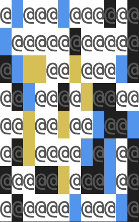

## Visualizing Visitor Logs

### Read

Data visualization is the graphic representation of data. It involves producing images 
that communicate relationships among the represented data. This is achieved by using a
mapping between graphics and data values. This mapping establishes how data 
values will be represented visually.

The Web Operations (WebOps) team at Amazon believes that if they visualize visits to the
Amazon home page as colored characters, they'll be able to detect patterns.
They have produced a mockup of a visualization where each visit is mapped to a single
colored character in a colored square. 

WebOps explains that there are four different types of visitors:
* Temporary (temporary visits are visualized with a `space` character)
  * Testing accounts are shown as empty yellow squares.
  * Anonymous visitors (not logged in), are shown as empty blue squares.
* Persistent (persistent accounts are visualized with an `@` character)
  * Logged-in Amazon accounts are shown as `@` symbols in white squares.
  * Logged-in Zappos accounts are shown as grey `@` symbols in black squares. 
    (Note: Zappos is an Amazon subsidiary)
    
The result demonstrates that of the visit types, logged in customers made up the majority
of visits, specifically with Amazon accounts:



WebOps has already built a prototype visualization system. The `VisitVisualizer` class
reads a log file containing information about visits to the Amazon homepage, and generates
a visualization in your terminal. 

The log file contains one line for each visit to the Amazon home page. For instance, this line indicates
that on May 2 at exactly 10:45, the visitor with ID "abcdef123456" visited
`amazon.com`:

`10:45:00.000Z2019-05-02|abcdef123456|amazon.com`

The `VisitVisualizer` provides each log line to the `VisitFactory` to determine 
the visit type. The `VisitFactory` returns a `Visit` object which can then
be visualized by calling its `visualize()` method. The `VisitFactory` is the class 
that does the mapping we explained above. It receives one data point, and returns 
an object that contains the information about how it should be visualized.

The WebOps team implemented the `Visit` class to represent an anonymous visitor. In addition
to `Visit`, they have created a subclass called `InvalidVisit`. This is used when a log line
cannot be classified by the `VisitFactory`, meaning it doesn't match any of our four visit 
types. `InvalidVisit` overrides methods in the `Visit` class to override the color and
character that will be printed.


**Note:** We show an inheritance relationship here with an open triangle. You can view the
uml [here](./VisitVisualizer.puml) to see how it is defined. 

The prototype currently has logic to identify the different types of visits, but currently can
only return a `Visit` or an `InvalidVisit` object for all log entries. 
WebOps has asked you to create the classes that will represent the
three remaining visit types, test visits, Amazon account visits, and Zappos account
visits. You will then need to update the `VisitFactory` to return the correct
objects from the `createVisitFromLogEvent()` method. There are `TODO`s marking the
correct return locations.

The chart below will provide you with the `VisitColor` and character to use for each class.

```
+------------+-----------+------------------------------------+
| Visit Type | Character | Color                              |
+:==========:+:=========:+:==================================:+
| Test       | `space`   | VisitColor.TEST_VISITOR_COLOR      |
+------------+-----------+------------------------------------+
| Amazon     | `@`       | VisitColor.AMAZON_VISITOR_COLOR    |
+------------+-----------+------------------------------------+
| Zappos     | `@`       | VisitColor.ZAPPOS_VISITOR_COLOR    |
+------------+-----------+------------------------------------+
```
You do **NOT** need to touch the tricky looking code in `Visit#visualize()`! The code manipulates
the colors that are printed in the terminal. If you get stuck, remember you can take a 
look at `InvalidVisit` for an example of a subclass!

Optional:
Try updating the provided uml to include your new classes. This practice will come in handy 
when you work on your project's diagrams!

When you have implemented your three new classes and updated the `VisitFactory`, run the
rde workflow or the `com.amazon.ata.inheritance.VisitVisualizerTest` from IntelliJ. A friendly picture should be output!

**You have completed this pre-work when:**
* You have implemented the 3 visit classes
* You have updated `VisitFactory` to return the correct visit objects
* All tests in `com.amazon.ata.inheritance.VisitVisualizerTest` are passing
* You have committed and pushed your code
* You have answered the canvas quiz
